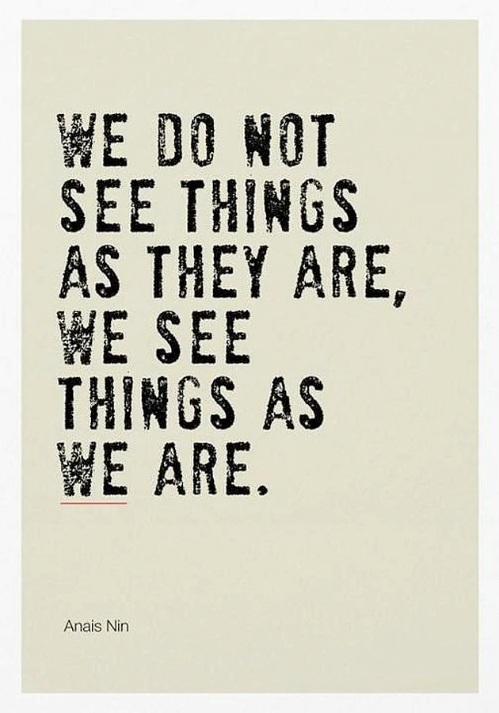

# Preface

## Motivation

# Part I - A New Management Philosophy
It's brutally hard to tell people when they are screwing up (...) Management is hard.
"At Apple we hire people to tell us what to do, not the other way around."

## 1. Build Radically Candid Relationships (Bringing your self to work)
- A radically candid relationship starts with the basic respect and common decency that every human being owes each other, regardless of worldview.

### It's called management, and it's your job

- Emotional labor is the key to being a good boss.

### How to be a good boss

- Bosses are responsible for results. They achieve these results not by doing all the work themselves but by guiding the people on their theams
- Bosses guide a team to achieve results.
- **Guidance**, **team**, **results**: these are the responsibilities of any boss.
  - Guidance: feedback
  - Team-building: hiring,firing,promoting
  - Results: Get things done

### Relationships, not power, drive you forward

- A good rule of thumb for any relationship is to leave three unimportant things unsaid each day.

### Radical Candor

- Radically Candor was too aggressive for Japanese, "politely persistent" worked well in Tokyo.
- Brits, despite all their politeness, tend to be even more candid than New Yorkers.

- 

### Care Personally:The First Dimension of Radical Candor
- 
- People evolve, and so your relationships must evolve with them. Care personally; don't put people in boxes and leave them there.

### Challenge Directly: The Second Dimension of Radical Candor

- If nobody is ever mad at you, you probably aren't challenging your team enough.

### What Radical Candor is Not

### Radical Candor is Universally Human, but interpersonally and culturally relative

## 2. Get, Dive, and Encourage Guidance (Create a culture of open communication)

### The "UM" story

### "Operationalizing" Good Guidance

### Radical Candor

#### Radically Candid praise "I admire that about you"

#### Radically Candid criticism "To keep winning, criticize the wins"

### Obnoxious Aggression

#### Obnoxiously aggressive criticism (Front-stabbing)

#### Obnoxiously aggressive praise (Belittling compliments)

### Manipulative Insincerity

#### Manipulatively insincere praise

### Ruinous Empathy

#### Ruinously empathetic praise "Just trying to say something nice"

### Moving Toward Radical Candor

#### Start by asking for criticism, not by giving it (Do not dish it out before you show you can take it)

#### Balance praise and criticism (Worry more about praise, less about criticism - but above all be sincere)

#### Understand the perilous border between Obnoxious Aggression and Radical Candor (Your work is shit)

#### Think of a simple example ("Your fly is down")

## 3. Understand What Motivates Each Person on Your Team (Helping people take a step in the direction of their dreams)

### Rethinking ambition

- right positions for right people
- challenging affects not just their feelings but also their income, their career growth, and their ability to get what they want out life.

- The Apple leader classification
  - Rock stars
  - Super stars
  - You need both
  
- Let go of your judgements
  - What is ambition?
  - What is stable?
  - Think about positive examples
  - 

### Growth Management

#### It is getting better all the time

### Understanding what matters and why

### The Problem with "Passion"

### Excellent Performance

#### Keep your top performers top of mind

#### Be a partner, not an absentee manager or a micromanager

### Excellent Performance/Gradual Growth Trajectory

#### Recognize, reward, but don't promote

#### Fair performance ratings

#### Recognition

#### Respect

#### The dangers of promotion obsession

### Excellent Performance/Steep Growth Trajectory

#### Keep superstars challenged

#### Keep them challenged (and figure out who'll replace them when they move on)

#### Don't squash them or block them

#### Not every superstar wants to manage

### Managing the middle

#### Raise the bar - There's no such thing as a B-player

### Poor performance/Negative Growth Trajectory

#### Part ways

#### How do you know when it's time to fire somebody?

#### Common lies managers tell themselves to avoid firing somebody who needs to be fired

1. It will get better.
2. Somebody is better than nobody.
3. A transfer is the answer.
4. It's bad for morale.

#### Be Radically Candid with the person you're firing

1. Recall a job you were terrible at and think how glad you feel that you're no longer in it.
2. Retaining people who are doing bad word penalizes the people doing excellent work.

### Low Performance/Steep Growth Trajectory

#### Manager, look at yourself in the mirror!

#### Wrong role

#### New to role; too much too fast

#### Personal problems

#### Poor fit

### No Permanent Markers

#### People change, and you have to change with them

## 4. Drive Results Collaboratively (Telling people what to do does not work.)

### Telling people what to do didn't work at Google

### Telling people what to do didn't work for Steve Jobs Either

### The art of getting stuff done without telling people what to do

### Listen ("Give the quite ones a voice" - Jony Ive)

#### Quiet listening

#### Loud listening

#### Create a culture of listening

#### Adapt to a culture of listening

### Clarify ("It is only by selection, by elimination, and by emphasis that we get at the real meaning of things." -Georgia O'Keefe)

#### Be clear in your own mind (Create a safe space to nurture new ideas)

#### Be clear to others (Make thoughts/ideas drop-dead easy for others to comprehend)

### Debate

#### Keep the conversation focused on ideas not egos

#### Create on obligation to dissent

#### Pause for emotion/exhaustion

#### Use humor and have fun

#### Be clear when the debate will end

#### Don't grab a decision just because the debate has gotten painful

### Decide (Push decisions into the facts, or pull facts into the decisions, but keep ego out)

#### You're not the decider (usually)

#### The decider should get facts, not recommendations

### Persuade ("Emotion.Credibility.Logic" -Aristotle)

#### Emotion (The listener's emotions, not the speaker's)

#### Credibility (Demonstrate expertise and humility)

#### Logic (Show your work)

### Execute (Minimize the collaboration tax)

#### Don't waste your team's time

#### Keep the "dirt under your fingernails"

#### Block time to execute

### Learn ("Consistency is the hobgoblin of little minds" - Ralph Waldo Emerson)

#### Pressure to be consistent

#### Burnout

# Part 2 - Tools & Techniques

## 5. Relationships (An approach to establishing trust with your direct reports)

### Stay centered (You can't give a damn about others if you don't give a damn about yourself)

#### Work-life integration

#### Figure out your "recipe" to stay centered and stick to it

#### Calendar

#### Show up for yourself

### Free at work

### Master the art of socializing at work

#### Even non-mandatory events can feel mandatory

#### Booze

### Respect Boundaries

#### Building Trust

#### Sharing Values

#### Demonstrating openness

- Paul Saffo: “strong opinions, weakly held” 

#### Physical space

#### Recognizing your own emotions

#### Master your reactions to others' emotions

- Acknowledge emotions

- Ask questions.

- Adding your guilt to other people's difficult emotions does not make them feel better.

- Telling other people how to feel will backfire.

- If you really cannot handle emotional outbursts, forgive yourself.

- Keep tissues a short walk away from your desk.

- Keep some closed bottles of water at your desk.

- Walk. don't sit.

## 6. Guidance (Ideas for getting/giving/encouraging praise & criticism)

In order to build a culture of Radically Candid guidance you need to get, give, and encourage both praise and criticism.

### Soliciting The Impromptu Guidance (Embrace the discomfort)

- You are the exception to the "criticize in private" rule of thumb
- Have a go-to question
- Embrace the discomfort
- Listen with the intent to understand, not to respond.
- Reward criticism to get more of it.
- Reward criticism to get more of it.
- Gauge the guidance you get.

### Orange Box (Make it not just safe but natural to criticize you)

### Management "Fix-it" weeks

### Giving Impromptu Guidance

#### Be humble

- Situation, behavior, impact.

- Left-hand column.

- "Ontological Humility"

#### Be helpful

- Stating your intention to be helpful can lower defenses.
- Show, don't tell.
- Finding help is better than offering it yourself.
- Guidance is a gift, not a whip or a carrot.

#### Give feedback immediately

- Say it in 2-3 minutes between meetings.
- Keep slack time in your calendar, or be willing to be late.
- Don't "save up" guidance for a 1:1 or performance review.
- Guidance has a short half-life.
- Unspoken criticism explodes like a dirty bomb.
- Avoid black holes.

#### In person (if possible)

- Immediate vs. in person
- Hierarchy of modes.
- Reply All do's and don'ts.
- Being in a remote office is hard.

#### Praise in public, criticize in private

- Corrections, factual observations, disagreements, and debates are different from criticism.
- Adapt to an individual's preferences.
- Group learning

#### Don't personalize

- The "fundamental attribution error" will harm the effectiveness of your guidance.
  - Using perceived personality attributes to explain someone else's behavior rather than considering one's own behavior and/or the situational factors that were probably the real cause of the other person's behavior.

- 
- 

- Say "that's wrong" not "you're wrong"
- The phrase "don't take it personally" is worse than useless.
- How not to personalize even when it really is personal.

#### Gauge your impromptu guidance, Get a baseline, Track your improvements

#### Being radically candid with your boss

#### Gender and guidance

##### Why Radical Candor may be harder for men managing women
##### Why gender bias makes Radical Gender harder for women
##### What can you do?
##### Men: don't "pull punches" with women
##### Women: demand criticism
##### Men and women: things to think about when you feel a woman is being "too aggressive"
- Switch genders
- Be more specific
- Don't use gendered language
- Never just say, "Be more likeable"

##### Things to think about if you're a woman who's being told, "You're abrasive"
- Never stop challenging directly
- Care personally - but kill the angel in the office.
- The competence/likeability research has not concluded that you weren't out of line.
- Just because it's wrong to kiss up and kick down does not mean it's right to do opposite
- Do not write men off.

##### Formal Performance Reviews
- No surprises
- Do not rely on your unilateral judgement
- Solicit feedback on yourself first
- Write it down
- Make a conscious decision about when to give the written review.
- Schedule at least fifty minutes in person, and do not do reviews back-to-back.
- Spend half the time looking back (diagnosis), half the time looking forward (plan).
- Schedule regular check-ins to assess how the plan is working.
- Deliver the rating/compensation news after the performance review.

### Prevent backstabbing (You are a boss, not a diplomat. Shuttle diplomacy won't work for you)

### Peer guidance
- "Whoops the Monkey"
- Peer gauging

### Speaking Truth to "Power"
- Explain it. Show it Explain it again.
- Ensure the meeting is "not for attribution"
- Take notes and project them
- Kick-start the conversation
- Prioritize issues
- Share notes right after  the meeting
- Ensure that your directs make and communicate changes
- Have these meetings once a year for each of your direct reports.

### Skip level meetings FAQs
- What if it becomes clear that an entire team has lost faith in their manager?
- What if people won't talk?
- What if people won't shut up?
- How do you strike the right balance between being supportive of the boss you're hearing about and being open to the team's thoughts?

## 7. Team (Techniques for avoiding boredom and burnout)

### Career Conversations (Understand people's motivations and ambitions to help them take a step in the direction of their dreams)

- Conversation one: life story
- The second conversations: dreams
- Conversation three: eighteen-month plan

### Growth Management (Figure out who needs what types of opportunities, and how you're going to provide them)

- Put names in boxes (temporarily!)
- Write growth plans
- Don't be an "easy grader" or a "hard a grader"
- Ensure fairness by level

### Hiring: Your Mentality and Your Process

#### Process
- Job description: define team "fit" as rigorously as you define "skills" to minimize bias.
- Blind skills assessments can also minimize bias.
- Use the same interview committee for multiple candidates, to allow for meaningful comparisons.
- Make interviews productive by jotting down your thoughts right away.
- In-person debrief/decision: if you're not dying to hire the person, don't make an offer.

### Firing (A necessary evil)

#### Do not wait too long
#### Do not make the decision unilaterally
#### Give a damn
#### Follow up

### Promotions (Be fair)
- Prepare
- Manage the time carefully, and don't let arguments go on too long.
- Get enough sleep the day before, exercise that morning, and eat a good breakfast.
- When it's all done, acknowledge how hard these conversations are.

### Reward Your Rock Stars (Don't give all the glory to the superstars)

#### Avoid promotion/status obsession
#### Say "thank-you"
#### Gurus
#### Public presentations

### Summary

### Avoid absentee management and micromanagement

## 8. Results (Things you can do to get stuff done together-faster)

1. 1:1 Conversations
2. Staff Meetings
3. Think Time
4. "Big Debate" Meetings
5. "Big Decision" Meetings
6. All-Hands Meetings
7. Meeting-Free Zones
8. Kanban Boards
9. Walk Around
10. Be Conscious of Culture

### 1:1 Conversations (Employees set the agenda, you listen and help them clarify)

#### Mind-set
#### Frequency
#### Show up!
#### Your direct report's agenda, not yours
#### Some good follow-up questions
- "Why"
- "How can I help"
- "What can I do or stop doing that would make this easier?"
- "What wakes you up at night"?
- "What are you working on that you don't want to work on?"
  - "Do you not want to work on it because you are not interested or because you think it's not important?"
  - "What can you do to stop working on it?"
- "How do you feel about priorities of the teams you're dependent on?"
  - "What are they working on that seems unimportant or even counterproductive?"
  - "What are they not doing that you wish they would do?"
  - "Have you talked to these other teams direct about your concerns? If not, why?" (Important note: the goal here is to encourage the people to raise the issue directly with each other, not to solve the problem for them. See "Prevent Backstabbing" in chapter six.)

#### Encourage new ideas in the 1:1.
- "What do you need to develop that idea further so that it's ready to discuss with the broader team? How can I help?"
- "I think you're on to something, but it's still not clear to me. Can you try explaining it again?"
- "Let's wrestle some more with it, OK?"
- "I understand what you mean, but I don't think others will. How can you explain it so it will be easier for them to understand?"
- "I don't think 'so-and-so" will understand this. Can you explain it again to make it clearer specifically for them?"
- "Is the problem really that they are too stupid to understand, or is it that you are not explaining it clearly enough?"

#### Signs you'll get from 1:1s that you're failing as a boss

- Cancellations
- Updates
- Good news only
- No criticism
- No agenda

### Staff Meetings (Review metrics, study hall updates, and identify (but do not make) key decisions)

#### Learn: review key metrics (twenty minutes)
#### Listen: put updates in a shared document (fifteen minutes)
#### Clarify: identify key decisions & debates (thirty minutes)

### Think Time (Block time to think, and hold that time sacred)

### "Big Debate" Meetings (Lower the tension by making it clear that you are debating, not deciding)

#### They lower tension

#### They allow you to slow down key decisions when appropriate

#### They foster a larger culture of debate

### "Big Decisions" Meetings (Push decisions into the facts, pull facts into the dceisions, and keep egos at bay)

### All-Hands Meetings (Bring others along)

### Execution time (Fight meeting proliferation)

### Kanban Boards (Make activity and workflows visible)

### Walk Around (Learn about small problems to prevent big ones)

### Be Conscious of Culture (Everyone is watching you, but that doesn't mean it's all about you)

#### People are listening. Like it or not, you're under the microscope

#### Clarify. Be vigilant about clarifying what you are communicating

#### Debate and decide explicitly. Don't let things that pervert your culture "just happen"

#### Persuade. Pay attention to the small things

#### Execute: Action should reflect your culture

#### Learn

#### Listen. . .

# Afterword

## Getting Started
### Prove You Can Take it Before You Start Dishing it out

#### Now you're ready to start having career conversations

#### In parallel: perfect your 1:1 conversations

#### Next

#### Take a deep breath. Assess.

#### If the answer to these three questions is "yes", you're ready to perfect staff meetings, decisions, and debates for your team.

#### Return to guidance

#### Fight meeting proliferation

Make sure you're not getting overscheduled.

#### Plan for the future of your team

#### Return to guidance

#### Walk around

#### Begin to take a more Radically Candid approach to the processes that your company may have in place.

## Afterword to the revised edition (Rolling Out Radical Candor)

### You

#### Improve using role plays and storytelling

#### Practise: What's your story?

#### Practice: The Feedback Triangle

#### Solicit Criticism First

1. solicit criticism
2. give praise
3. give criticism
4. gauge the criticism and adjust
5. encourage praise and criticism between others

##### Kim's Soliciting Feedback Story

### A go-to question you can actually image asking

- **Sincere**. People have well-tuned BS detectors. If you sound like you're parroting something you read in a book, even a great book, you're not going to sound sincere
- **Don't ask questions that can be answered with a yes or no.**  
  - "What could I do or stop doing"
- **Specific vs open-ended** 
  - "What could I do or stop doing that would make it easier to work with me?" 
  - "I worry that sometimes I interrupt people before they've had a chance to express themselves adequately. When have you seen me do that? Will you flag it for me if you see me do it next week?"
- **Frequency** Asking frequently for feedback helps to increase the likelihood that feedback is actionable.

#### Some questions:

- In the last week, when would you have preferred that I be more or less involved in your work?
- Tell me why I'm off base here.
- What's something I could have done differently this week to make your job easier?
- How could I best support your professional development right now?
- What's something I've done in the last week that made it difficult to work with me?
- What's a blind spot of mine that you have noticed?
- The most important thing you can do for both of us is to tell me when I've screwed up.
- I feel like I didn't do as well as I could have in that meeting, but I'm not sure what I did wrong. Can you help me figure out?
- I'm really trying to do X better. I know in theory it's a problem but I'm not always aware in the moment. Can you help me by pointing it out when you see it?

1. Did it produce useful feedback?
2. Did it sound natural, i.e, like something you'd actually say?

### Embrace the discomfort 

So much of putting Radical Candor into practice is being able to move through social awkwardness.
Ask your question to a friendly colleague **then count to six**. Do not allow yourself to say anything no matter how awkward you feel or they look. Of course, some will remain silent. If they do, tell them you'll give them more time but that you will comme back to them because you really want their feedback. **(Enforcing feedback)**

### Listen with the intent to understand, not to reply
- Your job is not to give advice, it's to listen.

### Make Listening Tangible: Reward The Candor

When someone offers you criticism, they are taking a risk. It is your job to make sure they are rewarded for taking that risk.

**Practice: Make Listening Tangible**
At a team meeting, share some feedback you received in the past week, what you learned from it, your gratitude for it, and what you plan to do about it.

**Practice: Reward criticism you disagree with**

### Build it into your existing scheduled

**Practice: add soliciting feedback to the end of your 1:1 agenda**

### Praise: Focus on the good stuff. Really.

### Apply The Same Discipline to Praise that you do to criticism

### Gauge Criticism

### Diversity and Inclusion

### What's next?

# References

- [1] https://agile-od.com/mmdojo/1762/radical-candor
- [2] https://wilte.wordpress.com/2019/09/18/radical-candor-kim-scott/
